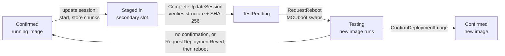

# In-Field Update overview

In-Field Update (IFU) lets a device running .NET **nanoFramework** replace its own firmware and
application while deployed, without a debugger or a host tool attached. It builds on
[MCUboot](https://docs.mcuboot.com/): every updatable image has two flash slots, the new image is
written to the slot that is *not* running, and the bootloader swaps it in on the next reboot.
If the new image does not prove itself, the previous one comes back.

The `nanoFramework.Runtime.InFieldUpdate` library is the managed API to that machinery. Everything
is exposed as static methods of `UpdateManager`.

> This API is optional. On devices where updates are performed entirely through another,
> host-driven mechanism, `UpdateManager` is not required.

## Images and slots

There are two images, updated independently (`ImageType`):

| `ImageType` | What it is |
|:-|:-|
| `NanoClr` | The nanoCLR firmware image. |
| `Deployment` | The deployment - the managed application and its assemblies. |

Each image has two slots (`SlotId`):

| `SlotId` | Role |
|:-|:-|
| `Primary` | The active execution slot - the image that runs. |
| `Secondary` | The staging area where a new image is written before it is swapped in. |

New images are only ever written to the **secondary** slot. The running image is never modified in
place, so a failed or interrupted download cannot brick the device.

## Update lifecycle

1. **Stage.** The application (or a host, or native code) opens an
   [update session](update-sessions.md), writes the signed image into the secondary slot chunk by
   chunk and completes the session. Completing verifies the image structure and its SHA-256
   before anything is scheduled.
2. **Swap.** A successfully completed session marks the image for a *test* swap. On the next
   reboot (`RequestReboot`) MCUboot verifies the signature and swaps the image in.
3. **Test.** The new image runs in the `Testing` state. It checks that it works and then
   [confirms itself](confirm-and-revert.md).
4. **Confirm or revert.** A confirmed image becomes permanent. An image that is not confirmed -
   because it crashed, hung, or decided it is broken - is replaced by the previous one on the next
   reboot.

## Update states

`UpdateManager.GetStatus(image)` reports where an image is in that lifecycle (`UpdateStatus`):

| `UpdateStatus` | Meaning |
|:-|:-|
| `Confirmed` | Running image is confirmed and no swap is scheduled. Normal operating state. |
| `Testing` | Running an unconfirmed test image. Unless confirmed, the previous image is restored on the next reboot. |
| `TestPending` | A one-time test swap is scheduled for the next reboot. |
| `PermanentPending` | A permanent swap is scheduled for the next reboot, with no test cycle. |
| `RollbackPending` | A revert to the previous image is scheduled for the next reboot. |
| `Unknown` | State could not be determined. |

## Who can write an image

Images can be staged by three kinds of writer (`UpdateSessionOwner`):

| `UpdateSessionOwner` | Writer |
|:-|:-|
| `Managed` | A managed application, through `UpdateManager`. |
| `WireProtocol` | A host over the Wire Protocol (debugger, nanoff). |
| `Native` | Native code on the device, for example an in-field update agent. |

Because they all target the same secondary slot, writing is gated by an **update session**: only
one writer can hold the session of an image at a time, so chunks from different writers can never
interleave. See [Update sessions](update-sessions.md).

## API map

| Area | Members | Documentation |
|:-|:-|:-|
| Query | `GetStatus`, `GetPrimaryImageInfo`, `GetSecondaryImageInfo`, `GetImageList`, `ImageInfo`, `ImageInfoExtensions.ToTable` | [Querying images](querying-images.md) |
| Stage | `StartUpdateSession`, `ResumeUpdateSession`, `StoreImageChunk`, `UpdateSession.Write`, `CompleteUpdateSession`, `AbortUpdateSession`, `EraseSecondaryImage` | [Update sessions](update-sessions.md) |
| Diagnostics | `GetUpdateSessionOwner`, `UpdateSessionResult` (returned by every session operation) | [Update sessions](update-sessions.md) |
| Confirm / revert | `ConfirmDeploymentImage`, `RequestDeploymentRevert`, `RequestClrRevert` | [Confirm and revert](confirm-and-revert.md) |
| Reboot | `RequestReboot` | [Confirm and revert](confirm-and-revert.md) |
| Provider contract (`nanoFramework.Runtime.InFieldUpdate.Provider` package) | `IUpdateProvider`, `UpdateAgentOptions`, `HealthCheck` | [Writing an update provider](writing-an-update-provider.md) |

To put all of this together in a library that downloads updates from a server or other provider,
see [Writing an update provider](writing-an-update-provider.md).
