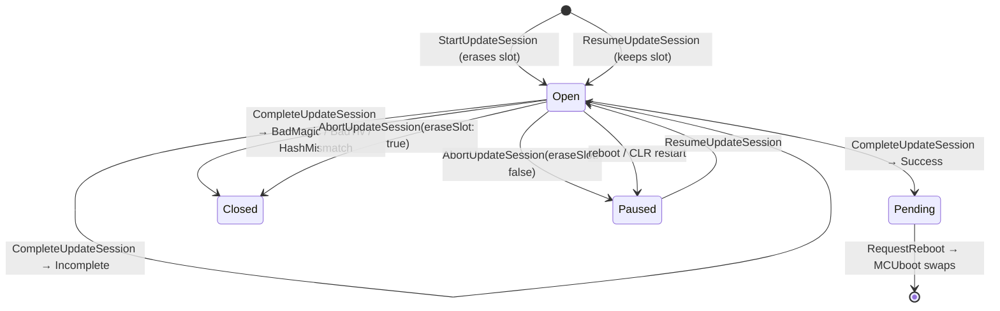

# Update sessions

An update image is staged into the secondary slot through an **update session**. Opening one
claims the image for this writer, so a managed download, a host writing over the Wire Protocol
and native code can never interleave chunks into the same slot.

A session is a small state machine:



*Paused* is not a runtime state - it only means "no session is open, but a partial image is in the
slot", which is exactly what `ResumeUpdateSession` looks for.

## Staging an image

```csharp
// total length is the size of the signed package (content length of the download)
UpdateSession session = UpdateManager.StartUpdateSession(ImageType.Deployment, totalLength);

if (session == null)
{
    // Busy, SwapInFlight, TooLarge, FlashError - see UpdateSessionResult
    Debug.WriteLine($"could not start: {UpdateManager.GetLastSessionError()}");
    return;
}

// chunks are appended in order; offset/count index into the buffer, as for Stream.Write
while (!session.IsComplete)
{
    int read = ReadNextChunk(buffer);

    if (!UpdateManager.StoreImageChunk(session, buffer, 0, read))
    {
        // the position did not advance, so the chunk can be retried
        break;
    }
}

if (UpdateManager.CompleteUpdateSession(session) == UpdateSessionResult.Success)
{
    // the image is verified (structure + SHA-256) and marked for a test swap
    UpdateManager.RequestReboot();
}
```

After the reboot MCUboot swaps the image in. The new application validates itself and calls
`ConfirmDeploymentImage()`; without that confirmation the previous image is restored on the
next reboot. See [Confirm and revert](confirm-and-revert.md).

### What to stage

`totalLength` and the bytes written are the **signed MCUboot image** exactly as produced by the
build: 32-byte header, payload and TLV area. Do not strip, decompress or re-encode it. The first
chunk of a fresh session must hold at least the whole 32-byte header, and the SHA-256 in the TLV
area is checked by `CompleteUpdateSession` against what was written.

### `StartUpdateSession`

- Claims the image and **erases the whole secondary slot** before returning. That can take a few
  seconds on large external flash; the call blocks until the erase is done.
- Returns `null` on failure; `GetLastSessionError()` says why: `Busy` (another writer holds a
  session), `SwapInFlight` (a swap is already scheduled), `TooLarge` (the image does not fit the
  slot), `FlashError` (the erase failed).
- Throws `ArgumentOutOfRangeException` if `totalLength` is not positive.

### `StoreImageChunk` and `UpdateSession.Write`

```csharp
bool ok = UpdateManager.StoreImageChunk(session, buffer, offset, count);
bool ok = session.Write(chunk); // same as StoreImageChunk(session, chunk, 0, chunk.Length)
```

- `offset` and `count` index into **the buffer**, as for `Stream.Write`. The position in the image
  is not a parameter: every chunk is appended at `session.NextOffset`, which the runtime advances by
  `count` on success.
- On failure the position does not advance, so the same chunk can be retried. Typical reasons:
  `BadMagic` (first chunk is not a valid MCUboot header), `TooLarge` (chunk runs past
  `TotalLength`), `BadToken` (stale session), `FlashError`.
- Chunk size is up to you. Larger chunks mean fewer calls; smaller chunks mean smaller RAM buffers
  and less to re-send after an interruption. A few KB (the sample uses 4096) is a reasonable start.

### `CompleteUpdateSession`

Verifies the staged image - structure plus a SHA-256 of the image compared with the digest in its
TLV area - and, if it is intact, marks it for a test swap on the next reboot. The signature itself
is verified by MCUboot at boot time.

| Result | Session | What to do |
|:-|:-|:-|
| `Success` | closed | Image verified and pending. Reboot now or later (`RequestReboot`). |
| `Incomplete` | **still open** | Fewer than `TotalLength` bytes stored. Keep writing, then complete again. |
| `BadMagic`, `BadTlv`, `HashMismatch` | closed, slot left as is | Download is corrupt or not the expected image. Start a fresh session and download again. |
| `BadToken` | - | The handle is stale or foreign. |
| `FlashError` | - | Flash failure, or MCUboot refused to mark the image pending. |

### `AbortUpdateSession`

```csharp
UpdateManager.AbortUpdateSession(session, eraseSlot: false); // pause
UpdateManager.AbortUpdateSession(session, eraseSlot: true);  // discard
```

- `eraseSlot: false` is a **pause**: the session is released but what was stored stays in the slot
  for a later `ResumeUpdateSession`.
- `eraseSlot: true` discards the partial image. The session is released even if the erase fails,
  so there is nothing to retry; the return value tells you whether the slot is actually clean. If it
  is not, call `EraseSecondaryImage` or just start a new session later (which erases anyway).

## Resuming an interrupted download

A download interrupted by a reboot, a lost connection or a device reset does not have to start over.
Nothing is persisted for this: the secondary slot itself carries the state, and
`ResumeUpdateSession` works out how far the previous session got.

```csharp
// the first 32 bytes are the MCUboot header - cheap to fetch and enough to tell this image
// from whatever else might be sitting in the slot
byte[] expectedHeader = HttpRange(url, 0, 31);

UpdateSession session =
    UpdateManager.ResumeUpdateSession(ImageType.Deployment, totalLength, expectedHeader)
    ?? UpdateManager.StartUpdateSession(ImageType.Deployment, totalLength);

while (session != null && !session.IsComplete)
{
    // ask the server only for what is missing
    byte[] chunk = HttpRange(url, session.NextOffset, session.NextOffset + ChunkSize - 1);

    if (!UpdateManager.StoreImageChunk(session, chunk, 0, chunk.Length))
    {
        // pause instead of discarding: the next run resumes from here
        UpdateManager.AbortUpdateSession(session, false);
        return;
    }
}
```

`session.NextOffset` is where the server should continue from. It is never further than what was
actually stored: the runtime rewinds to the start of the erase block holding the last written
byte and erases it, because a block interrupted mid-program cannot be repaired by writing to it
again. If the whole image had already been stored, `NextOffset` equals `TotalLength` and you can go
straight to `CompleteUpdateSession`.

Passing `expectedHeader` matters. After a completed swap the secondary slot holds the
*previous* image, with a perfectly valid header - only the caller can tell that apart from a
paused download. Without the check, `ResumeUpdateSession` would happily resume the wrong image
(`CompleteUpdateSession` would then fail with `HashMismatch`, but only after the whole transfer).

When `ResumeUpdateSession` returns `null`, `GetLastSessionError()` says why:

- `NoImage` - slot erased or too little stored. Start a fresh session.
- `HeaderMismatch` - the slot holds a different image (or a different `totalLength`). Start a fresh
  session.
- `Busy`, `SwapInFlight`, `TooLarge`, `FlashError` - as for `StartUpdateSession`.

The [IFU_SessionUpdate sample](../Samples/IFU_SessionUpdate/Program.cs) walks through start,
pause, resume and complete with an image synthesised in RAM.

## The `UpdateSession` handle

| Member | Meaning |
|:-|:-|
| `Image` | The image this session stages. |
| `Token` | Opaque token checked on every chunk. Not a secret: it keeps writers from interleaving, it does not authenticate them. |
| `TotalLength` | Total length declared when the session was opened (header, payload and TLV area). |
| `NextOffset` | Image-relative offset the next chunk will be written at. |
| `IsComplete` | `NextOffset >= TotalLength`. |
| `IsResumed` | The session came from `ResumeUpdateSession` rather than `StartUpdateSession`. |
| `Version` | Version from the staged image's MCUboot header, or `null` before the header has been written. |
| `HeaderSize` | MCUboot header size, or 0 while unknown. |
| `ImageSize` | Payload size declared by the header (bytes between header and TLV area), or 0 while unknown. |
| `Write(byte[])` | Shorthand for `StoreImageChunk(this, data, 0, data.Length)`. |

The handle may be handed to another thread, but must never be used by two writers at once.

## Session rules

- One session per image, across every writer on the device. `GetUpdateSessionOwner(image)` says
  who holds it (`None`, `Managed`, `WireProtocol`, `Native`); a second writer gets
  `UpdateSessionResult.Busy`.
- Reopening as the same writer replaces its own session, so an abandoned handle cannot wedge the
  image for good.
- `StartUpdateSession` erases the whole secondary slot, which takes a few seconds on large
  external flash.
- `EraseSecondaryImage` is refused while a session is open.
- After `CompleteUpdateSession` (other than `Incomplete`) or `AbortUpdateSession` the handle is
  stale: further use returns `UpdateSessionResult.BadToken`.
- `AbortUpdateSession(session, eraseSlot: false)` is a pause - what was stored stays for a later
  `ResumeUpdateSession`. With `eraseSlot: true` the session is released even if the erase fails,
  so there is nothing to retry; the return value tells you whether the slot is actually clean.
- Sessions live in RAM and every reboot releases them, a CLR-only restart (a deploy from Visual
  Studio, `RequestReboot`) included. A device can therefore never come back with a slot claimed by
  an application that is gone. What was already written to the slot is untouched, which is exactly
  what `ResumeUpdateSession` picks up.
- `GetLastSessionError()` reports the last outcome the runtime recorded for *any* writer, so read
  it right after the call you are interested in.

## `EraseSecondaryImage`

```csharp
bool erased = UpdateManager.EraseSecondaryImage(ImageType.Deployment);
```

Erases the whole secondary slot of an image. **Destructive** - whatever was staged there is lost.
Use it only to deliberately discard a staged or partial image; `StartUpdateSession` already erases
the slot itself. Fails while any writer holds a session on the image.

## `UpdateSessionResult` reference

| Value | Meaning | Typical reaction |
|:-|:-|:-|
| `Success` | The operation succeeded. | - |
| `Busy` | Another writer holds a session on the image, or a flash operation is in progress. | Back off and retry later. |
| `BadToken` | The session is stale (completed, aborted, released by a restart) or foreign. | Open a new session (resume). |
| `BadOffset` | Chunk offered at an unexpected offset. Wire Protocol only - managed sessions are sequential by construction. | - |
| `TooLarge` | Image does not fit the slot, or a chunk runs past `TotalLength`. | Check the package and `totalLength`. |
| `FlashError` | Flash open/erase/write/read failed, or MCUboot refused to mark the image pending. | Retry; if persistent, report. |
| `BadMagic` | First chunk does not carry a valid MCUboot header. | Wrong file - check the provider. |
| `SwapInFlight` | A swap is already scheduled or in progress for the image. | Stage after the next reboot. |
| `NoImage` | Resume: no image header in the slot. | Start a fresh session. |
| `HeaderMismatch` | Resume: stored header or length does not match the expected one. | Start a fresh session. |
| `Incomplete` | Complete: not every byte stored yet. Session stays open. | Keep writing. |
| `BadTlv` | Complete: TLV area missing, malformed or inconsistent with the total length. | Download again. |
| `HashMismatch` | Complete: SHA-256 of the staged data does not match the TLV digest. | Download again. |
| `BadArgument` | An argument was invalid. | Fix the call. |
| `NoSlot` | The image has no secondary slot on this target. | IFU not available for this image. |
